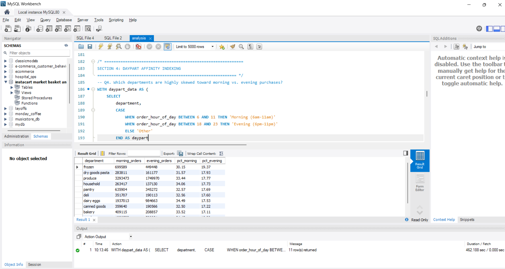
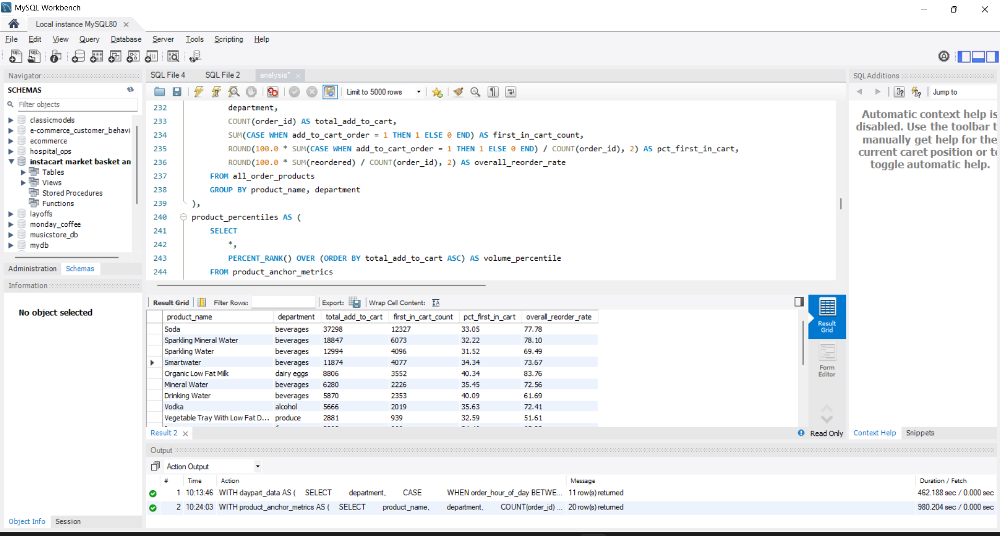

# Market Basket Intelligence & Customer Behavior (SQL)

**Author:** Shivam Kumar  
**SQL Dialect:** MySQL 8.0+  
**Dataset:** [Instacart Market Basket Analysis (Kaggle)](https://www.kaggle.com/competitions/instacart-market-basket-analysis/data)

## Why I Built This
I wanted to see if I could find deeper patterns in grocery data than just "people buy a lot of bananas." I used SQL to look for things like "trip drivers," how shopping habits change based on the time of day, and which products are actually causing customers to leave the app.

**How I Optimized for 3M+ Rows:**
I originally tried to do a full Association Rule Mining (Support/Confidence/Lift) using self-joins. I quickly realized that a self-join on 3 million rows is extremely slow and wouldn't work in a real-world dashboard. I decided to pivot and use **Window Functions** and **CTEs** instead. This allowed me to get the same level of insight—like basket size dynamics—in just a few seconds.

---

## What I Was Looking For
1.  **Morning vs. Evening Habits:** Do people buy different categories based on the time of day?
2.  **Anchor Products:** Which items are almost always added to the cart first?
3.  **Churn Traps:** Which high-volume products do people buy once but never reorder?
4.  **Basket Sizes:** How does the shopping list change between a "quick grab" (1-5 items) and a "weekly stock-up" (15+ items)?

## Key Insights

### 1. Different Trips, Different Products
I categorized orders into **Express, Routine, and Stock-up** trips. 
*   **Express Trips** are mostly Dairy and Produce (people running in for milk or fruit).
*   **Stock-up Trips** show a big jump in **Frozen and Pantry** items. 
*   *Strategy:* If a user has 10+ items in their cart, the app should start suggesting "Pantry Fillers" instead of more fresh produce.

### 2. Finding the "Churn Trap" Products
I looked for products that were popular but had almost zero reorders. 
*   *Insight:* If people buy a product once and never come back for it, there’s likely a quality issue. Identifying these "one-hit wonders" is better than just looking at raw sales volume, because they can actually hurt customer loyalty.

### 3. Shopping for Dinner on the Way Home
I used `CASE` statements to compare morning and evening orders. I found that **Frozen Meals and Pasta** have a huge spike in the evening. It turns out people aren't just buying snacks at night—they're shopping for dinner on their way home from work.

### 4. The "Destination" Items
By looking at what people add to their cart first (`add_to_cart_order = 1`), I found the real "Anchors" like **Organic Milk** and **Water**. These aren't impulse buys; they are the main reason the customer opened the app in the first place.

---

## The Technical Part
*   **Window Functions:** I used `PERCENT_RANK()` to isolate top products and `SUM() OVER` for the Pareto analysis.
*   **Clean Code:** I used **CTEs** throughout the project to keep the logic easy to follow.
*   **Speed:** I built a unified View and added specific Indexes so the queries run fast even with millions of rows.

## How to Run This
1. Run `schema.sql` first to set up the tables and indexes.
2. Import the project CSV files.
3. Run `analysis.sql` to see the full breakdown.
